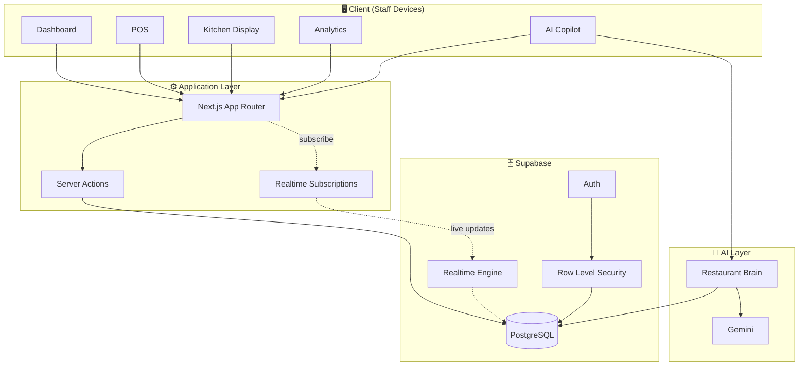
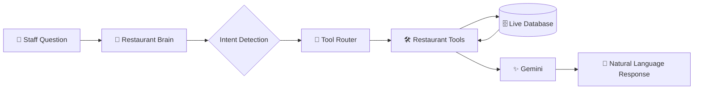

<div align="center">


# RestaurantOS

### The AI-Powered Operating System for Modern Restaurants

*One platform. For every operation. Zero fuss.*

<br/>

[](https://nextjs.org)
[](https://react.dev)
[](https://www.typescriptlang.org)
[](https://supabase.com)
[](https://tailwindcss.com)
[](https://ai.google.dev)
[](#-license)

<br/>

**Built for VibeAthon 6.0** — *Smart Restaurant Management System*

</div>

<br/>

> **"Restaurants don't need more software. They need one system that actually talks to itself."**

RestaurantOS replaces the patchwork of disconnected tools — a POS here, a spreadsheet there, a group chat for the kitchen — with a single, real-time operating system for restaurant staff. Tables, orders, kitchen tickets, analytics, and an AI copilot all read and write to the same source of truth, so nothing gets lost between the front of house and the back.

This is **not** a food-delivery app. It's internal infrastructure — built for the people running the restaurant, not the people ordering from it.

<br/>

---

## 📖 Table of Contents

- [The Problem](#-the-problem)
- [The Solution](#-the-solution)
- [Key Features](#-key-features)
- [Application Modules](#-application-modules)
- [System Architecture](#-system-architecture)
- [AI Architecture — Restaurant Brain](#-ai-architecture--restaurant-brain)
- [Technology Stack](#-technology-stack)
- [Folder Structure](#-folder-structure)
- [Setup Instructions](#-setup-instructions)
- [Environment Variables](#-environment-variables)
- [Screenshots & Demo](#-screenshots--demo)
- [Architecture Decisions](#-architecture-decisions)
- [Future Roadmap](#-future-roadmap)
- [Known Limitations](#-known-limitations)
- [Demo Credentials](#-demo-credentials)
- [Deployment](#-deployment)
- [Developer Information](#-developer-information)
- [License](#-license)

<br/>

---

## 🎯 The Problem

Running a restaurant means running five different systems that don't know about each other.

| Pain Point | What It Looks Like Day-to-Day |
|---|---|
| 📝 **Manual order management** | Orders scribbled on paper or shouted across the kitchen |
| 🐢 **Slow waiter ↔ kitchen communication** | Tickets get lost, orders get delayed, tables get frustrated |
| 🧩 **Disconnected software** | A POS for billing, a spreadsheet for inventory, a notebook for reservations |
| 🕳️ **Poor operational visibility** | Managers find out about problems after the shift is over |
| 📉 **No real analytics** | Decisions made on gut feeling instead of data |
| 🤖 **No AI assistance** | Nothing surfaces insight — someone has to go looking for it |
| 👥 **Difficult staff coordination** | No shared view of who's doing what, or what's urgent |
| 🪑 **Inefficient table management** | No live view of what's available, seated, or needs cleaning |
| 💳 **Delayed billing** | Manual tallying at the register slows down table turnover |
| 🧠 **No actionable insight** | Data exists, but nobody has time to turn it into a decision |

Most tools solve *one* of these. RestaurantOS solves the whole workflow at once.

<br/>

---

## 💡 The Solution

RestaurantOS is a **single, unified platform** covering the full restaurant operating loop — from the moment a table is seated to the moment analytics reflect that shift's performance.

<table>
<tr>
<td width="50%" valign="top">

**Core Operations**
- 📊 Live Dashboard
- 🧾 Point of Sale (POS)
- 🪑 Table Management
- 👨‍🍳 Kitchen Display System
- 🍽️ Menu Management
- 📦 Order Management

</td>
<td width="50%" valign="top">

**Intelligence Layer**
- 📈 Restaurant Analytics
- 👥 Staff Management
- 🤖 AI Restaurant Copilot
- 🔔 Real-time Notifications
- 🗓️ Reservations *(Beta)*
- 📉 Inventory *(Beta)*

</td>
</tr>
</table>

Every module writes to the **same data layer**, in real time. That's what makes the AI copilot useful — it isn't answering from a script, it's reading the same live state your staff sees on screen.

<br/>

---

## ✨ Key Features

<table>
<tr>
<td width="33%" valign="top">

### 🔴 Real-Time Everything
Table status, kitchen tickets, and order state update live across every connected device — no refresh needed.

</td>
<td width="33%" valign="top">

### 🧠 Grounded AI Copilot
Ask about inventory, kitchen load, or today's revenue. The AI queries real restaurant data — it doesn't guess.

</td>
<td width="33%" valign="top">

### 🔐 Role-Based Access
Managers, waiters, kitchen staff, and cashiers each see a workspace built for their job, not a generic admin panel.

</td>
</tr>
<tr>
<td width="33%" valign="top">

### 🪑 Live Floor Map
See every table's status at a glance — available, seated, dirty, or ready to turn.

</td>
<td width="33%" valign="top">

### 👨‍🍳 Kitchen Display System
Digital ticket queue replaces paper slips and shouted orders across the pass.

</td>
<td width="33%" valign="top">

### 📊 Operational Analytics
Revenue, order volume, and performance trends in one dashboard — no spreadsheets required.

</td>
</tr>
</table>

<br/>

---

## 🧩 Application Modules

| Module | Status | Description |
|---|:---:|---|
| **Authentication** | ✅ Live | Email login/registration, Google OAuth, secure sessions, guided onboarding |
| **Dashboard** | ✅ Live | Live KPIs, revenue snapshot, table/order overview, quick actions, activity feed |
| **Menu Management** | ✅ Live | Categories, items, availability toggles, pricing |
| **Table Management** | ✅ Live | Live table status (available / occupied / dirty), QR-ready architecture |
| **POS** | ✅ Live | Create orders, add items and quantities, send directly to kitchen |
| **Kitchen Display** | ✅ Live | Live order queue across preparing → ready → served |
| **Order Management** | ✅ Live | Full order history and status tracking |
| **Analytics** | ✅ Live | Revenue and operational metrics, restaurant-level insights |
| **AI Copilot** | ✅ Live | Tool-based restaurant assistant grounded in live data |
| **Reservations** | 🧪 Beta | Booking queue — core flow works, edge cases still being hardened |
| **Inventory** | 🧪 Beta | Stock tracking — functional, not yet feature-complete |
| **Customers** | 🧪 Beta | Customer profiles — early implementation |

<br/>

---

## 🏗️ System Architecture



**Read path:** client subscribes to live data via Supabase Realtime; writes flow through Server Actions, never direct client mutation.

**Write path:** every mutation is validated, authorized via role/permission checks, and persisted through PostgreSQL with Row Level Security enforced at the database layer.

<br/>

---

## 🤖 AI Architecture — Restaurant Brain

The AI copilot is **not a generic chatbot bolted onto the UI**. It's a grounded, tool-based system that reasons over real operational data before responding.



| Stage | Responsibility |
|---|---|
| **Intent Detection** | Determines what the staff member is actually asking — inventory, sales, kitchen load, table status |
| **Tool Router** | Selects the correct read-only tool for that intent |
| **Restaurant Tools** | Query live restaurant data directly from the database |
| **Gemini** | Turns structured, grounded data into a clear natural-language answer |

> **Why this matters:** the model never fabricates restaurant numbers. It retrieves the real figures first, then explains them — so "how much inventory is left on the tomatoes" gets a real answer, not a plausible-sounding guess.

<br/>

---

## 🛠️ Technology Stack

<table>
<tr><th align="left">Layer</th><th align="left">Technology</th></tr>
<tr><td><b>Frontend</b></td><td>Next.js · React · TypeScript · Tailwind CSS · shadcn/ui · Framer Motion</td></tr>
<tr><td><b>Backend</b></td><td>Supabase · PostgreSQL · Server Actions</td></tr>
<tr><td><b>Authentication</b></td><td>Supabase Auth · Email/Password · Google OAuth</td></tr>
<tr><td><b>Database</b></td><td>PostgreSQL · Realtime Subscriptions · Row Level Security</td></tr>
<tr><td><b>AI</b></td><td>Google Gemini · Restaurant Brain (Intent Detection → Tool Router → Structured Data → Response)</td></tr>
<tr><td><b>Deployment</b></td><td>Vercel</td></tr>
</table>

<br/>

---

## 📁 Folder Structure

<details>
<summary><b>Click to expand full project structure</b></summary>

```
restaurant-os/
├── app/                      # Next.js App Router
│   ├── (public)/             # Landing, login, register
│   ├── (staff)/               # Authenticated staff console
│   │   ├── dashboard/
│   │   ├── pos/
│   │   ├── kitchen/
│   │   ├── tables/
│   │   ├── menu/
│   │   ├── analytics/
│   │   ├── ai/
│   │   ├── reservations/      # Beta
│   │   ├── inventory/         # Beta
│   │   └── customers/         # Beta
│   ├── api/                  # Route handlers (AI chat, auth callback)
│   └── actions/               # Server Actions ("the backend")
├── components/                # UI components by domain
├── lib/
│   ├── supabase/               # Client + server Supabase instances
│   ├── ai/                     # Restaurant Brain orchestration
│   └── utils/
├── services/                  # Reusable data-fetching functions
├── config/                    # Constants, permissions, feature flags
├── types/                     # Shared TypeScript types
├── validations/               # Zod schemas
├── supabase/
│   └── migrations/             # Sequential SQL migrations
└── tests/                      # Business rule tests
```

</details>

<br/>

---

## 🚀 Setup Instructions

### 1. Clone the repository

```bash
git clone https://github.com/<your-username>/restaurant-os.git
cd restaurant-os
```

### 2. Install dependencies

```bash
npm install
```

### 3. Configure environment variables

```bash
cp .env.example .env.local
```

Fill in the values described in the [Environment Variables](#-environment-variables) section below.

### 4. Set up Supabase

1. Create a project at [supabase.com](https://supabase.com)
2. Apply the migrations in `supabase/migrations/` (via the Supabase CLI or SQL editor)
3. Copy your **Project URL** and **anon key** into `.env.local`

### 5. Set up Gemini

1. Generate an API key at [Google AI Studio](https://ai.google.dev)
2. Add it to `.env.local` as `GEMINI_API_KEY`

### 6. Run the development server

```bash
npm run dev
```

Visit **`http://localhost:3000`** 🎉

<br/>

---

## 🎬 Demo Mode

RestaurantOS ships with a one-click **Demo Mode** so you can explore the platform without manually creating tables, orders, or menu items.

From the **Dashboard**, open **Quick Actions → Activate Demo Mode**. This seeds your restaurant with realistic sample data — active tables, in-progress orders, a populated menu, and recent revenue history — so every module (Kitchen Display, Analytics, Restaurant Copilot) has something real to show immediately.

Prefer the command line? The same seed data can be applied directly:

```bash
npm run demo:reset
```

> 💡 Demo Mode is the fastest way to evaluate Restaurant Copilot — ask it *"What's today's revenue?"* or *"Which tables are occupied?"* right after activating it.

<br/>

---

## 🔑 Environment Variables

| Variable | Description | Required |
|---|---|:---:|
| `NEXT_PUBLIC_SUPABASE_URL` | Your Supabase project URL | ✅ |
| `NEXT_PUBLIC_SUPABASE_ANON_KEY` | Supabase anonymous/public key | ✅ |
| `SUPABASE_SERVICE_ROLE_KEY` | Supabase service role key (server-only) | ✅ |
| `GEMINI_API_KEY` | Google Gemini API key for the AI copilot | ✅ |
| `NEXT_PUBLIC_SITE_URL` | Base URL of the deployed app | ✅ |
| `GOOGLE_OAUTH_CLIENT_ID` | Google OAuth client ID | ⚙️ Optional |
| `GOOGLE_OAUTH_CLIENT_SECRET` | Google OAuth client secret | ⚙️ Optional |

> ⚠️ Never commit `.env.local`. The service role key bypasses Row Level Security — treat it as a secret with production-level sensitivity.

<br/>

---

## 📸 Screenshots & Demo


> 📷 **Dashboard Overview**


> 📷 **POS Screen** 


> 📷 **Kitchen Display**


> 📷 **AI Copilot**


> 📷 **Menu Management** 


> 📷 **Analytics**


> 📷 **Authentication**


> 📷 **Table Management**

 


>

<br/>

<div align="center">

**🎬 Product Walkthrough GIF**


</div>

<br/>

---

## 🧭 Architecture Decisions

- **Server Actions over a separate API layer** — mutations live next to the domain logic they belong to, with no extra HTTP boundary to maintain.
- **Row Level Security at the database layer** — access control isn't just enforced in application code; it's enforced where the data lives.
- **Realtime subscriptions over polling** — table and kitchen state need to feel instant, not "refresh in a few seconds."
- **Tool-based AI over a raw chat completion** — the AI copilot reads real data through defined tools instead of freeform generation, which keeps its answers grounded and auditable.
- **Beta-gating incomplete modules** — Reservations, Inventory, and Customers ship early but are explicitly labeled, rather than presented as finished.

<br/>

---

## 🗺️ Future Roadmap

- [ ] Promote Reservations, Inventory, and Customers out of Beta
- [ ] QR-code table ordering for guests
- [ ] Multi-location support for restaurant groups
- [ ] Deeper analytics: cohort trends, menu-item performance
- [ ] Expanded AI tool registry (staff scheduling insight, demand forecasting)
- [ ] Automated CI pipeline (lint, test, build on PR)

<br/>

---

## ⚠️ Beta Features & Current Limitations

| Feature | Status | Notes |
|---------|:------:|------|
| Reservations | 🧪 Beta | Placeholder module. UI is available, but full reservation workflow and backend integration are planned for a future release. |
| Inventory | 🧪 Beta | Placeholder module. Inventory tracking, stock management, and supplier workflows are planned but not yet implemented. |
| Customers | 🧪 Beta | Placeholder module. Customer profiles, loyalty, and CRM capabilities are planned for a future update. |
| Role-based Access | 🧪 Beta | Role assignment is fully server-controlled and cannot be self-elevated. Server-side route enforcement is still being completed, so a small number of manager-only pages remain directly accessible to authenticated staff, although sensitive write actions are protected. |
| Staff Onboarding | 🧪 Beta | New staff accounts are created by managers with a fixed initial password and no email notification. Suitable for demo purposes, but a secure invitation and credential setup flow is planned before production release. |

<br/>

---

## 🔐 Demo Credentials

> Recommended login for judges. This account has full access to RestaurantOS and Restaurant Copilot.

| Role | Email | Password |
|---|---|---|
| Manager | `qa_newuser_test@example.com` | `password123` |
| Waiter | `alex@rest.com` | `Password123!` |
| Kitchen Staff | `john@rest.com` | `Password123!` |
| Cashier | `andrea@rest.com` | `Password123!` |


<br/>

---

## 🌐 Deployment

| Resource | Link |
|---|---|
| **GitHub Repository** | `https://github.com/Hezron-lix/restaurantOS.git` |
| **Live Demo** | `[[insert deployed URL]](https://restaurant-os-lix.vercel.app/)` |

Deployed on **Vercel** — connect the repository, add the environment variables above, and deploy.

<br/>

---

## 👤 Developer Information

**Hezron Belix**
Team Lead

Built for **VibeAthon 6.0** — *Smart Restaurant Management System*

Satisfies all five phases of the problem statement:

✔️ Modern UX &nbsp;·&nbsp; ✔️ Authentication &nbsp;·&nbsp; ✔️ Digital Operations &nbsp;·&nbsp; ✔️ Restaurant Management &nbsp;·&nbsp; ✔️ Intelligent Operations

<br/>

---

## 📄 License

Released under the **MIT License**.

```
MIT License

Copyright (c) 2026 Hezron Belix

Permission is hereby granted, free of charge, to any person obtaining a copy
of this software and associated documentation files (the "Software"), to deal
in the Software without restriction, including without limitation the rights
to use, copy, modify, merge, publish, distribute, sublicense, and/or sell
copies of the Software, subject to the following conditions:

The above copyright notice and this permission notice shall be included in
all copies or substantial portions of the Software.

THE SOFTWARE IS PROVIDED "AS IS", WITHOUT WARRANTY OF ANY KIND, EXPRESS OR
IMPLIED, INCLUDING BUT NOT LIMITED TO THE WARRANTIES OF MERCHANTABILITY,
FITNESS FOR A PARTICULAR PURPOSE AND NONINFRINGEMENT.
```

<br/>

<div align="center">

**Built with coffee☕, real-time data, and a strong opinion that restaurants deserve one system, not ten.**

</div>
