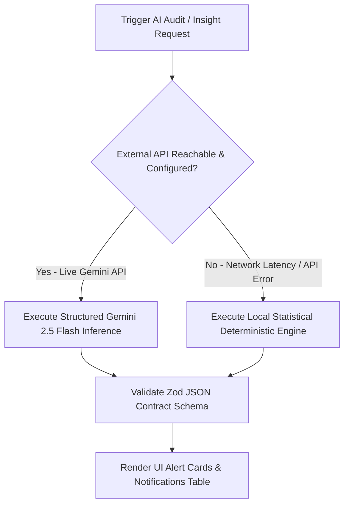

# 🤖 RestaurantOS: AI Operational Intelligence & Diagnostic Strategy
**Practical AI Architecture & Deterministic Fallback Contract (Immutable Contract)**

---

## 1. Operational AI Philosophy & Constraints

In stark contrast to generic hackathon projects that incorporate frivolous conversational AI chatbots or gimmick customer assistants, **RestaurantOS** enforces an uncompromising rule: **Every AI feature must provide measurable, real-time operational value to restaurant staff and management.**

### Core AI Design Rules:
- **No Generic Chatbots**: Conversational menu ordering assistants or open-ended guest chat interfaces are strictly forbidden. Restaurant operators do not need chat bots; they require back-of-house operational diagnostic intelligence.
- **Strict Phase 1 Feature Boundary**: AI capabilities are explicitly limited to two transformative operational domains:
  1. **Predictive Ingredient Inventory Depletion**
  2. **Executive Manager Operational Insights**
- **Deterministic Response Schemas**: All Large Language Model (LLM) prompts must execute against rigid Zod JSON formatting contracts to guarantee structured UI card rendering without text hallucinations.

---

## 2. Target AI Operational Features (Phase 1 Bound)

### A. Inventory Depletion Prediction Engine
The AI evaluates live kitchen ticket ordering velocity against current raw stock quantities in the `inventory` table to project ingredient runout timelines before service disruptions occur.
- **Example Output #1**: *"🧀 Cheddar Cheese consumption velocity is currently 2.4x higher than normal; projected stock depletion in approximately 45 minutes."*
- **Example Output #2**: *"🥩 Ribeye Steak reserves are down to 8 units—recommend toggling item to 'Out of Stock' ahead of dinner rush."*

### B. Manager Operational & Velocity Insights
The AI synthesizes daily operational logs from `orders`, `order_items`, and `table_sessions` to identify preparation latency bottlenecks and demand spikes.
- **Example Output #1**: *"📈 Lunch dining demand is running 35% higher than typical weekday averages—table turnover velocity currently at 42 minutes."*
- **Example Output #2**: *"🍔 Most ordered item today is the Signature Gourmet Burger representing 28% of all order volume."*

---

## 3. Deterministic Local Fallback Strategy (Zero Demo Failure)

A live hackathon stage environment introduces network Wi-Fi instability, API rate limits, or potential third-party LLM cloud provider timeouts. To guarantee absolute evaluation immunity, RestaurantOS implements an automated **Deterministic Local Fallback Architecture** within `services/ai.ts`:



### The Invariance Guarantee:
- **Zero UI Variation**: Whether diagnostic insights are generated live by Google Gemini or dynamically computed by our fallback mathematical statistical engine, the JSON payload structural schema remains 100% identical. 
- **Transparent Execution**: The frontend Manager Dashboard and Waiter Console render the exact same high-impact visual alert cards, iconography, and urgent advice without displaying error banners or degradation notices.
- **Statistical Precision**: When working locally without external cloud connectivity, the local fallback engine interrogates active PostgreSQL row counts (e.g., dividing remaining `current_stock_units` by active order item consumption intervals) to generate accurate, authentic runtime predictions like: *"Cheese will run out in approximately 45 minutes."*

---

## 4. Technical Schema Contract

Both live cloud LLMs and deterministic local fallbacks adhere strictly to this interface contract:

```typescript
export interface AiOperationalInsightDTO {
  insight_type: 'INVENTORY_DEPLETION' | 'DEMAND_VELOCITY' | 'PREP_BOTTLENECK';
  urgency_level: 'NORMAL' | 'WARNING' | 'CRITICAL';
  title: string;               // e.g., "Cheese Inventory Warning"
  message: string;             // e.g., "Cheese will run out in approximately 45 minutes."
  recommended_action?: string; // e.g., "Prep auxiliary cheese backup immediately."
  affected_entity_id?: string; // Links directly to inventory or menu_item ID
}
```
