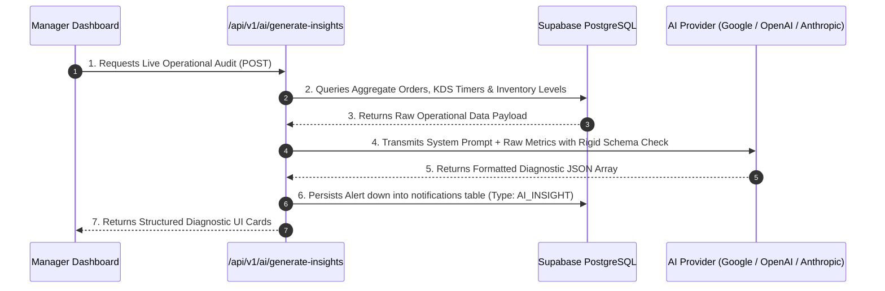

# 🤖 RestaurantOS: AI Operational Intelligence & Diagnostic Strategy
**Practical AI Architecture Contract (Immutable Contract)**

---

## 1. Operational AI Philosophy & Constraints

In stark contrast to generic hackathon projects that incorporate frivolous conversational AI chatbots or gimmick customer assistants, **RestaurantOS** enforces an uncompromising rule: **Every AI feature must provide measurable, real-time operational value to restaurant staff and management.**

### Core AI Design Rules:
- **No Generic Chatbots**: Conversational menu ordering assistants or open-ended guest chat interfaces are strictly forbidden. Restaurant operators do not need chat bots; they require back-of-house operational diagnostic intelligence.
- **Strict Phase 1 Feature Boundary**: AI capabilities are explicitly limited to two transformative operational domains:
  1. **Predictive Ingredient Inventory Depletion**
  2. **Executive Manager Operational Insights**
- **Deterministic Response Schemas**: All Large Language Model (LLM) prompts must execute against rigid Zod JSON formatting contracts to guarantee structured UI card rendering without text hallucinations.

---

## 2. Target AI Operational Features (Phase 1 Bound)

### A. Inventory Depletion Prediction Engine
The AI evaluates live kitchen ticket ordering velocity against current raw stock quantities in the `inventory` table to project ingredient runout timelines before service disruptions occur.

- **Example Output #1**: *"🧀 Cheddar Cheese consumption velocity is currently 2.4x higher than normal; projected stock depletion in approximately 45 minutes."*
- **Example Output #2**: *"🥩 Ribeye Steak reserves are down to 8 units—recommend toggling item to 'Out of Stock' ahead of dinner rush."*
- **Trigger Mechanism**: Evaluated asynchronously after every 10th order ticket or whenever an item hits its defined `threshold_warning_units` parameter.

### B. Manager Operational & Velocity Insights
The AI synthesizes daily operational logs from `orders`, `order_items`, and `table_sessions` to identify preparation latency bottlenecks and demand spikes.

- **Example Output #1**: *"📈 Lunch dining demand is running 35% higher than typical weekday averages—table turnover velocity currently at 42 minutes."*
- **Example Output #2**: *"🍔 Most ordered item today is the Signature Gourmet Burger representing 28% of all order volume."*
- **Example Output #3**: *"⚠️ Grill Station preparation latency has increased from 14 mins to 26 mins—recommend redirecting auxiliary prep staff to assist."*
- **Trigger Mechanism**: Triggered on demand via the Manager Dashboard or generated automatically every 30 minutes via scheduled async evaluations.

---

## 3. Technical Implementation & Prompt Engineering



### Prompt Engineering Architecture:
To ensure high accuracy, the system constructs an analytical context block containing real-time SQL aggregates (average ticket cooking duration, active table occupancy count, consumption speed per ingredient unit). The LLM is restricted to a structured JSON tool-calling response interface:

```typescript
export interface AiOperationalInsightDTO {
  insight_type: 'INVENTORY_DEPLETION' | 'DEMAND_VELOCITY' | 'PREP_BOTTLENECK';
  urgency_level: 'NORMAL' | 'WARNING' | 'CRITICAL';
  title: string;          // e.g., "Cheese Inventory Warning"
  message: string;        // e.g., "Cheese will run out in approximately 45 minutes."
  recommended_action?: string; // e.g., "Prep auxiliary cheese backup immediately."
  affected_entity_id?: string; // Relates to menu_item or inventory ID
}
```

---

## 4. Integration Decoupling
To protect system stability during the hackathon judging evaluation, the AI integration wrapper located inside `services/ai.ts` utilizes an abstracted provider interface (`AI_PROVIDER="google" | "openai" | "anthropic"`). If external network connectivity experiences degradation, the service cleanly falls back to statistical deterministic algorithms without locking UI rendering.
