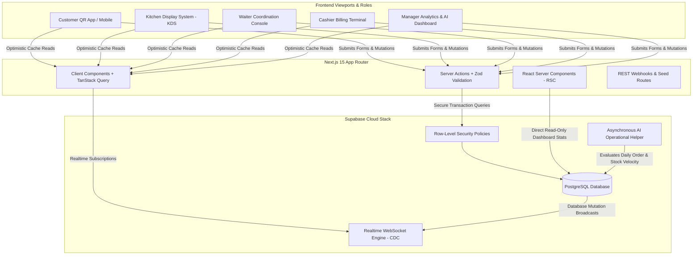

# 🏗️ RestaurantOS: System Architecture & Technical Specifications
**Architectural Blueprint & Real-Time Topology (Immutable Contract)**

---

## 1. Architectural Philosophy

The **RestaurantOS** platform is architected around a **Lean, Modular, and Demo-Optimized** structural model built upon Next.js 15, TypeScript, Tailwind CSS, TanStack Query, and Supabase. 

To maintain peak presentation stability and code clarity during the hackathon evaluation, unnecessary enterprise layers—such as third-party payment gateway webhooks, thermal printer hardware drivers, POS card terminal hooks, custom event buses (Kafka/RabbitMQ), and distributed microservices—are completely excluded. All features are encapsulated inside a highly cohesive monolithic SaaS architecture utilizing modern serverless edge standards.

---

## 2. High-Level System Overview

---

## 3. Hybrid Rendering Model (Next.js 15)

Our application strictly enforces boundary separation between Server and Client rendering:

### React Server Components (RSC)
- **Primary Domain**: Executive Manager Dashboard, Daily Analytics summaries, Menu catalog structure, and Static layouts.
- **Execution**: Run exclusively on server infrastructure. They directly query PostgreSQL database tables via server-side utilities without exposing database credentials or adding query logic to client bundles.

### Client Components (Interactive & Real-Time Surfaces)
- **Primary Domain**: Kitchen Display System (KDS), Waiter alert feeds, Cashier checkout tables, and Customer interactive order builders.
- **Execution**: Marked with `"use client"`. They manage local interactive UI transitions (powered by Framer Motion), maintain TanStack Query cache synchronization, and listen directly to Supabase Realtime WebSocket streams.

---

## 4. Data Mutation & Validation Strategy

We supersede legacy REST endpoints by standardizing on **React Server Actions** for all user interface form mutations:
1. **Input Boundary Validation**: Every Server Action input payload must be evaluated by a rigorous TypeScript Zod runtime schema located within the `validations/` directory.
2. **Server Execution**: Once validated, the Server Action invokes specific business service wrappers in `services/` that execute type-safe SQL queries or Supabase client mutations.
3. **Cache Invalidation & Realtime Sync**: Successful database mutations automatically fire PostgreSQL Change Data Capture (CDC) events over webhooks while simultaneously triggering Next.js path re-evaluations via `revalidatePath` and TanStack Query query-key invalidations.

---

## 5. Realtime WebSocket Channel Topology

To ensure our target of sub-100ms operational synergy across all five dining room personas, Supabase Realtime broadcasts across three dedicated subscription channels:
- `orders:live`: Streams inserts and updates from the `orders` and `order_items` tables directly to the Kitchen Display System (KDS) and Cashier billing terminals.
- `notifications:alerts`: Streams targeted operational alerts (e.g., dish prep completed, waiter table calls, AI operational insights) to designated role consoles.
- `tables:status`: Streams real-time table status transitions (`AVAILABLE` ↔ `RESERVED` ↔ `SEATED` ↔ `DIRTY`) across all floor staff viewports simultaneously.

---

## 6. Directory Structure & Domain Separation

Our codebase enforces zero circular dependencies across clean enterprise folders:
- `app/`: Next.js 15 App Router routing trees, layout boundaries, and error handlers.
- `actions/`: Domain-isolated React Server Actions (`orders.ts`, `tables.ts`, `kitchen.ts`, `billing.ts`).
- `components/`: Modular domain interface assemblies and atomic `shadcn/ui` foundational elements.
- `config/`: Application environment settings, UI state enums, and workflow finite state machine constants.
- `docs/`: Immutable technical architecture and evaluation contract specifications.
- `hooks/`: Declarative client-side React hooks for TanStack Query execution and WebSocket channels.
- `lib/`: Utility formatting functions, class merging helpers, and static calculation helpers.
- `services/`: Encapsulated database access layers and external integrations.
- `supabase/`: Database migration SQL models, seeding demo scripts, and authentication rules.
- `types/`: Comprehensive TypeScript interfaces reflecting strict database entities.
- `validations/`: Standalone Zod runtime boundary validation contracts.
