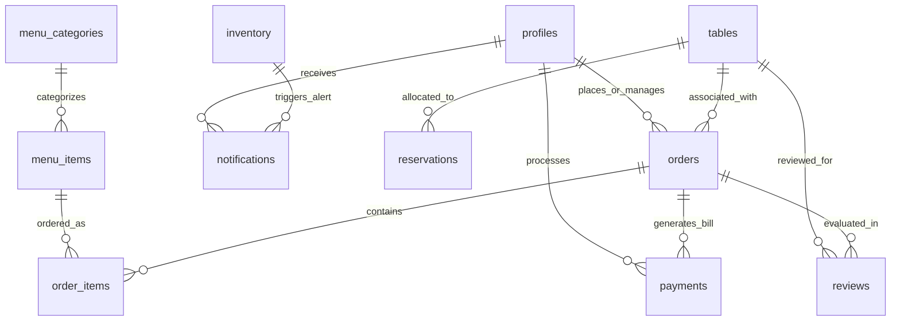

# 🗄️ RestaurantOS: Database Schema & Relational Design
**Relational Architecture & Row-Level Security Contract (Immutable Contract)**

---

## 1. Database Philosophy & Design Constraints

The **RestaurantOS** database engine is powered by PostgreSQL hosted via Supabase. Following our **Lean & Demo-First** operational mandate, the database schema is strictly constrained to the exact **12 core relational entities** required to execute our end-to-end hackathon workflow. 

### Fundamental Design Principles:
- **Strict Single-Restaurant Scope**: Multi-tenant keys (`tenant_id`, `branch_id`, `chain_id`) are excluded to optimize UI response times and query execution simplicity.
- **Integer Currency Representation**: All monetary pricing fields are stored as integer values representing the smallest currency denomination (**cents**) to completely eliminate IEEE-754 floating-point rounding discrepancies.
- **UUID Primary Keys**: All relational entities employ auto-generated UUIDv4 primary keys to prevent numerical sequence guessing and facilitate safe distributed identity generation.
- **3NF Normalization**: Rigid relational table modeling with explicit foreign key cascading rules (`ON DELETE CASCADE` for parent-child dependencies; `ON DELETE RESTRICT` for financial and audit history protection).

---

## 2. Entity-Relationship Diagram (ERD)

---

## 3. Core Relational Tables Specification

### 1. `profiles`
Extends user authentication accounts with Role-Based Access Control (RBAC) classifications.
- `id`: `UUID` (PK, references `auth.users(id)` `ON DELETE CASCADE`)
- `email`: `VARCHAR(255)` (NOT NULL, UNIQUE)
- `full_name`: `VARCHAR(100)` (NOT NULL)
- `role`: `ENUM('guest', 'waiter', 'kitchen', 'cashier', 'manager')` (NOT NULL, DEFAULT `'guest'`)
- `created_at`: `TIMESTAMPTZ` (DEFAULT `now()`)
- `updated_at`: `TIMESTAMPTZ` (DEFAULT `now()`)

### 2. `menu_categories`
Organizes restaurant dish catalogs into structured digital groupings.
- `id`: `UUID` (PK, DEFAULT `gen_random_uuid()`)
- `name`: `VARCHAR(100)` (NOT NULL) — *e.g., "Appetizers", "Main Courses", "Beverages"*
- `description`: `TEXT`
- `display_order`: `INTEGER` (NOT NULL, DEFAULT `0`)
- `is_active`: `BOOLEAN` (NOT NULL, DEFAULT `true`)
- `created_at`: `TIMESTAMPTZ` (DEFAULT `now()`)

### 3. `menu_items`
Detailed operational catalog of prepared dishes and kitchen production parameters.
- `id`: `UUID` (PK, DEFAULT `gen_random_uuid()`)
- `category_id`: `UUID` (FK references `menu_categories(id)` `ON DELETE RESTRICT`)
- `name`: `VARCHAR(150)` (NOT NULL)
- `description`: `TEXT`
- `price_cents`: `INTEGER` (NOT NULL) — *Stored in cents (e.g., 1499 = $14.99)*
- `prep_time_minutes`: `INTEGER` (NOT NULL, DEFAULT `15`)
- `image_url`: `TEXT`
- `is_available`: `BOOLEAN` (NOT NULL, DEFAULT `true`) — *Toggled live by kitchen staff when ingredients run out*
- `created_at`: `TIMESTAMPTZ` (DEFAULT `now()`)
- `updated_at`: `TIMESTAMPTZ` (DEFAULT `now()`)

### 4. `inventory`
Tracks vital raw ingredient quantities to drive operational AI depletion warnings.
- `id`: `UUID` (PK, DEFAULT `gen_random_uuid()`)
- `item_name`: `VARCHAR(100)` (NOT NULL, UNIQUE) — *e.g., "Cheddar Cheese", "Brioche Buns", "Ribeye Steaks"*
- `current_stock_units`: `INTEGER` (NOT NULL)
- `threshold_warning_units`: `INTEGER` (NOT NULL) — *Low stock trigger level*
- `unit_type`: `VARCHAR(30)` (NOT NULL) — *e.g., "slices", "kilograms", "bottles"*
- `consumption_rate_per_order`: `INTEGER` (NOT NULL, DEFAULT `1`)
- `updated_at`: `TIMESTAMPTZ` (DEFAULT `now()`)

### 5. `tables`
Physical restaurant table configurations and real-time floor occupancy status.
- `id`: `UUID` (PK, DEFAULT `gen_random_uuid()`)
- `table_number`: `INTEGER` (NOT NULL, UNIQUE)
- `capacity`: `INTEGER` (NOT NULL)
- `status`: `ENUM('AVAILABLE', 'RESERVED', 'SEATED', 'DIRTY')` (NOT NULL, DEFAULT `'AVAILABLE'`)
- `current_qr_token`: `VARCHAR(255)` (NULL) — *Ephemeral session token preventing off-site order spam*
- `updated_at`: `TIMESTAMPTZ` (DEFAULT `now()`)

### 6. `reservations`
Advance booking schedules and guest party allocation queues.
- `id`: `UUID` (PK, DEFAULT `gen_random_uuid()`)
- `table_id`: `UUID` (FK references `tables(id)` `ON DELETE SET NULL`)
- `guest_name`: `VARCHAR(150)` (NOT NULL)
- `phone`: `VARCHAR(50)` (NOT NULL)
- `guest_count`: `INTEGER` (NOT NULL)
- `reservation_time`: `TIMESTAMPTZ` (NOT NULL)
- `status`: `ENUM('PENDING', 'CONFIRMED', 'SEATED', 'CANCELLED')` (NOT NULL, DEFAULT `'PENDING'`)
- `created_at`: `TIMESTAMPTZ` (DEFAULT `now()`)

### 7. `orders`
Header transactional records linking seated guests, table locations, and assigned floor servers.
- `id`: `UUID` (PK, DEFAULT `gen_random_uuid()`)
- `table_id`: `UUID` (FK references `tables(id)` `ON DELETE RESTRICT`)
- `customer_id`: `UUID` (FK references `profiles(id)` `ON DELETE SET NULL`, Optional)
- `waiter_id`: `UUID` (FK references `profiles(id)` `ON DELETE SET NULL`, Optional)
- `status`: `ENUM('PLACED', 'PREPARING', 'READY', 'SERVED', 'BILLED', 'CANCELLED')` (NOT NULL, DEFAULT `'PLACED'`)
- `total_cents`: `INTEGER` (NOT NULL, DEFAULT `0`)
- `special_instructions`: `TEXT`
- `created_at`: `TIMESTAMPTZ` (DEFAULT `now()`)
- `updated_at`: `TIMESTAMPTZ` (DEFAULT `now()`)

### 8. `order_items`
Individual line items inside an order, enabling granular preparation tracking across kitchen stations.
- `id`: `UUID` (PK, DEFAULT `gen_random_uuid()`)
- `order_id`: `UUID` (FK references `orders(id)` `ON DELETE CASCADE`)
- `menu_item_id`: `UUID` (FK references `menu_items(id)` `ON DELETE RESTRICT`)
- `quantity`: `INTEGER` (NOT NULL, DEFAULT `1`)
- `item_price_cents`: `INTEGER` (NOT NULL) — *Locked price at time of order*
- `status`: `ENUM('QUEUED', 'COOKING', 'READY')` (NOT NULL, DEFAULT `'QUEUED'`)
- `notes`: `TEXT`

### 9. `payments`
Financial settlement ledger for completed table order checks.
- `id`: `UUID` (PK, DEFAULT `gen_random_uuid()`)
- `order_id`: `UUID` (FK references `orders(id)` `ON DELETE RESTRICT`, UNIQUE)
- `cashier_id`: `UUID` (FK references `profiles(id)` `ON DELETE SET NULL`)
- `amount_cents`: `INTEGER` (NOT NULL)
- `payment_method`: `ENUM('CASH', 'CARD', 'DIGITAL_WALLET')` (NOT NULL)
- `status`: `ENUM('PENDING', 'COMPLETED', 'VOID')` (NOT NULL, DEFAULT `'COMPLETED'`)
- `paid_at`: `TIMESTAMPTZ` (DEFAULT `now()`)

### 10. `notifications`
Unified realtime alerting inbox for servers, kitchen staff, and AI managerial operational insights.
- `id`: `UUID` (PK, DEFAULT `gen_random_uuid()`)
- `recipient_role`: `ENUM('waiter', 'kitchen', 'cashier', 'manager')` (NOT NULL)
- `recipient_id`: `UUID` (FK references `profiles(id)` `ON DELETE SET NULL`, Optional for role broadcast)
- `type`: `ENUM('ORDER_READY', 'WAITER_CALL', 'INVENTORY_ALERT', 'AI_INSIGHT')` (NOT NULL)
- `title`: `VARCHAR(150)` (NOT NULL)
- `message`: `TEXT` (NOT NULL) — *e.g., "Cheese will run out in approx. 45 minutes."*
- `is_read`: `BOOLEAN` (NOT NULL, DEFAULT `false`)
- `created_at`: `TIMESTAMPTZ` (DEFAULT `now()`)

### 11. `reviews`
Post-meal dining experience evaluations used for daily operational quality analytics.
- `id`: `UUID` (PK, DEFAULT `gen_random_uuid()`)
- `order_id`: `UUID` (FK references `orders(id)` `ON DELETE SET NULL`, Optional)
- `table_id`: `UUID` (FK references `tables(id)` `ON DELETE SET NULL`, Optional)
- `rating`: `INTEGER` (NOT NULL) — *Constrained between 1 and 5*
- `comment`: `TEXT`
- `created_at`: `TIMESTAMPTZ` (DEFAULT `now()`)

### 12. `analytics_daily`
Historical executive summary ledger aggregating end-of-day restaurant performance metrics.
- `id`: `UUID` (PK, DEFAULT `gen_random_uuid()`)
- `date`: `DATE` (NOT NULL, UNIQUE)
- `total_revenue_cents`: `BIGINT` (NOT NULL, DEFAULT `0`)
- `total_orders`: `INTEGER` (NOT NULL, DEFAULT `0`)
- `average_prep_time_seconds`: `INTEGER` (NOT NULL, DEFAULT `0`)
- `table_turnover_rate`: `NUMERIC(5, 2)` (NOT NULL, DEFAULT `0.00`)
- `most_ordered_item_id`: `UUID` (FK references `menu_items(id)` `ON DELETE SET NULL`)

---

## 4. Required Database Indexes & Performance Optimization
To guarantee seamless sub-100ms real-time queries during high-concurrency hackathon evaluation, explicit composite B-Tree indexes must be deployed across high-frequency join columns:
- `CREATE INDEX idx_orders_table_status ON orders(table_id, status);`
- `CREATE INDEX idx_order_items_order_status ON order_items(order_id, status);`
- `CREATE INDEX idx_notifications_role_read ON notifications(recipient_role, is_read);`
- `CREATE INDEX idx_reservations_time_status ON reservations(reservation_time, status);`

---

## 5. Row-Level Security (RLS) Policy Declarations
Every table enforces strict default denial (`ALTER TABLE <name> ENABLE ROW LEVEL SECURITY;`) paired with declarative role permissions:
- **`profiles`**: Public read for active staff display names; write access restricted strictly to managers and self.
- **`menu_categories` / `menu_items` / `tables`**: Public read for all guests and staff; write access restricted strictly to managers and kitchen chefs (for stock availability toggles).
- **`orders` / `order_items` / `notifications` / `reservations`**: Full Read/Write access granted to authenticated operational roles (`waiter`, `kitchen`, `cashier`, `manager`). Guests are restricted to reading orders tied explicitly to their validated table token session.
- **`payments` / `analytics_daily`**: Exclusive Read/Write access restricted to `cashier` and `manager` operational roles.
