# 🎬 RestaurantOS: Hackathon Evaluation & Live Demo Strategy
**Demo-First Presentation Script (Immutable Contract)**

---

## 1. Demo-First Development Mandate
Every implementation decision in RestaurantOS must directly enhance our live presentation capability. During a 3-day hackathon evaluation, judges evaluate working operational software—not theoretical background services or invisible microservices.

### Golden Rules of the Demo:
- **Zero Fake Animations**: Real-time order routing across terminals must derive directly from live Supabase PostgreSQL WebSockets and local database transactions.
- **Instantaneous Impact**: Any step requiring manual browser page refreshing or sluggish polling loops is considered a failure.
- **Deterministic Scripting**: The 5-minute evaluation presentation follows an unyielding, pre-tested sequence of interactions designed to showcase operational coordination across all five restaurant roles.

---

## 2. The 5-Minute Live Evaluation Script

```mermaid
gantt
    title Live 5-Minute Hackathon Demo Timeline
    dateFormat  s
    axisFormat  %M:%S
    section Customer & Queue
    Scan QR & Place Table Order         :0, 45s
    section Kitchen (KDS)
    Instant KDS Routing & Cooking Timer :45, 90s
    section Waiter Console
    Automated Alert & Food Delivery     :90, 135s
    section Cashier POS
    Rapid Bill Settlement & Table Clear :135, 180s
    section Manager & AI
    Executive KPIs & Live AI Alerts       :180, 240s
    section Q&A
    Architectural & Tech Defense        :240, 300s
```

### Stage 1: The Guest Experience (0:00 – 0:45)
- **Actor**: Customer at Table 4 (Simulated via Mobile Smartphone / Responsive Viewport).
- **Action**: 
  1. Scans Table 4 physical QR code; lands directly inside the interactive live digital menu session.
  2. Demonstrates that menu item availability is live (no out-of-stock items present).
  3. Selects *Signature Gourmet Burger* and *Craft IPA Beer*, adds special instructions (*"Medium rare, sauce on side"*), and clicks **Place Order**.
- **Visual WOW Factor**: Order submits instantaneously; button animates to a confirmation state with a smooth Framer Motion transition without page reloading.

### Stage 2: Kitchen Display System - KDS (0:45 – 1:30)
- **Actor**: Kitchen Chef (Simulated via Touchscreen Tablet Viewport).
- **Action**: 
  1. Instantaneously (<100ms), Table 4's order ticket materializes on the active KDS monitor via Supabase Realtime WebSockets.
  2. Chef clicks **Start Cooking**; an active cooking timer attaches immediately to the order card, signaling that preparation is underway.
  3. Upon completion, Chef clicks **Mark All Items Ready**.
- **Visual WOW Factor**: Ticket slides off the active cooking screen and instantly broadcasts an automated network alert.

### Stage 3: Waiter Coordination Console (1:30 – 2:15)
- **Actor**: Floor Waiter (Simulated via Handheld Mobile Viewport).
- **Action**: 
  1. Immediately as the Chef touches "Ready", an urgent visual notification card bounces onto the Waiter Console: *"🔔 Table 4 — Burger & Beer Ready at Grill Station!"*
  2. Waiter delivers the meal to Table 4 and taps **Acknowledge Alert & Mark Served**.
- **Visual WOW Factor**: Notification disappears cleanly; Table 4 floor status updates from `ORDERING` to `SERVED`.

### Stage 4: Cashier Terminal & Settlement (2:15 – 3:00)
- **Actor**: Restaurant Cashier (Simulated via Desktop POS Viewport).
- **Action**: 
  1. Table 4 guest finishes dining and requests check settlement.
  2. Cashier clicks Table 4 on the billing POS screen; itemized charges appear instantly with exact tax computations in integer cents ($14.99 + $6.50).
  3. Cashier taps **Complete Payment Settlement**.
- **Visual WOW Factor**: Bill marks as closed; physical Table 4 icon on the restaurant floor plan transforms immediately to `DIRTY / CLEARING` status for turn-around tracking.

### Stage 5: Executive Manager Dashboard & AI Operational Assistant (3:00 – 4:00)
- **Actor**: General Manager (Simulated via Full Resolution Desktop Screen).
- **Action**: 
  1. Switches to Executive Manager Dashboard; daily revenue accumulation chart and table turnover velocity KPIs immediately tick upward.
  2. Focus turns to the **AI Operational Assistant Panel**.
  3. System triggers a live AI diagnostic evaluation; analytical alert cards render on screen:
     - *"🧀 Cheddar Cheese consumption velocity is running high today; projected stock depletion in approximately 45 minutes."*
     - *"🍔 Most ordered item today is the Signature Burger (representing 28% of total volume)."*
     - *"📈 Lunch demand velocity is running 35% higher than historical weekday averages."*
- **Visual WOW Factor**: Demonstrates practical AI operational utilities solving real dining bottlenecks rather than useless conversation chatbots.

### Stage 6: Technical Defense & Q&A (4:00 – 5:00)
- **Highlights for Judges**: Explain our lean Next.js 15 Server Actions architecture, integer currency safety, immutable real-time PostgreSQL schema, and strict adherence to SOLID modular engineering principles.
