# 🎬 RestaurantOS: Hackathon Evaluation & Live Demo Strategy
**Demo-First Presentation Script (Immutable Contract)**

---

## 1. Demo-First Development Mandate
Every implementation decision in RestaurantOS must directly enhance our live presentation capability. During a 3-day hackathon evaluation, judges evaluate working operational software—not theoretical background services or invisible microservices.

### Golden Rules of the Demo:
- **Zero Fake Animations**: Real-time order routing across terminals must derive directly from live Supabase PostgreSQL WebSockets and local database transactions.
- **Instantaneous Impact**: Any step requiring manual browser page refreshing or sluggish polling loops is considered a failure.
- **Deterministic Scripting & Seeding**: Powered by `seed.ts`, our demo launches into a bustling restaurant simulation with pre-configured orders and inventory warning triggers.

---

## 2. One-Command Demo Restoration (`npm run demo:reset`)

To allow unlimited testing practice and guarantee a crisp, pristine starting state before walking onto the judging stage, the entire demo environment is completely resettable with a single terminal command:

```bash
npm run demo:reset
```

### What Happens in < 2 Seconds:
1. All transient demo test transactions, customer orders, billing records, and notification alerts are wiped clean.
2. `seed.ts` automatically repopulates all 12 relational database tables with realistic, high-fidelity dine-in restaurant data.
3. **Table 4** is reset to `AVAILABLE` with a fresh signed table token ready for live stage evaluation.
4. *Cheddar Cheese* inventory is deliberately seeded at `14 units` (below the warning threshold of `15 units`) to immediately showcase our AI inventory runout prediction capabilities without waiting for simulated order accumulation.

---

## 3. The 5-Minute Live Evaluation Script



```mermaid
gantt
    title Live 5-Minute Hackathon Demo Timeline
    dateFormat  s
    axisFormat  %M:%S
    section Customer & Queue
    Scan QR & Place Table Order         :0, 45s
    section Kitchen (KDS)
    Instant KDS Routing & Cooking Timer :45, 90s
    section Waiter Console
    Automated Alert & Food Delivery     :90, 135s
    section Cashier POS
    Rapid Bill Settlement & Table Clear :135, 180s
    section Manager & AI
    Executive KPIs & Live AI Alerts       :180, 240s
    section Q&A
    Architectural & Tech Defense        :240, 300s
```

### Stage 1: The Guest Experience (0:00 – 0:45)
- **Actor**: Customer at Table 4 (Simulated via Mobile Smartphone Viewport).
- **Action**: 
  1. Scans Table 4 physical QR code; lands directly inside the interactive live digital menu session.
  2. Selects *Signature Gourmet Burger* and *Craft IPA Beer*, adds special instructions (*"Medium rare, sauce on side"*), and clicks **Place Order**.
- **Visual WOW Factor**: Order submits instantaneously via Server Actions; button animates to confirmation state with a smooth Framer Motion transition without page reloading.

### Stage 2: Kitchen Display System - KDS (0:45 – 1:30)
- **Actor**: Kitchen Chef (Simulated via Touchscreen Tablet Viewport).
- **Action**: 
  1. Instantaneously (<100ms), Table 4's order ticket materializes on the active KDS monitor via Supabase Realtime WebSockets.
  2. Chef clicks **Start Cooking**; an active cooking timer attaches immediately to the order card.
  3. Upon completion, Chef clicks **Mark All Items Ready**.
- **Visual WOW Factor**: Ticket slides off active cooking screen and instantly broadcasts an automated network alert.

### Stage 3: Waiter Coordination Console (1:30 – 2:15)
- **Actor**: Floor Waiter (Simulated via Handheld Mobile Viewport).
- **Action**: 
  1. Immediately as the Chef touches "Ready", an urgent notification card bounces onto the Waiter Console: *"🔔 Table 4 — Burger & Beer Ready at Grill Station!"*
  2. Waiter delivers the meal to Table 4 and taps **Acknowledge Alert & Mark Served**.

### Stage 4: Cashier Terminal & Settlement (2:15 – 3:00)
- **Actor**: Restaurant Cashier (Simulated via Desktop POS Viewport).
- **Action**: 
  1. Table 4 guest finishes dining and requests check settlement.
  2. Cashier clicks Table 4 on the billing POS screen; itemized charges appear instantly with exact tax computations in integer cents ($14.99 + $6.50).
  3. Cashier taps **Complete Payment Settlement**.
- **Visual WOW Factor**: Bill marks closed; Table 4 icon on the floor plan transforms immediately to `DIRTY / CLEARING` status for turnaround tracking.

### Stage 5: Executive Manager Dashboard & AI Operational Assistant (3:00 – 4:00)
- **Actor**: General Manager (Simulated via Full Resolution Desktop Screen).
- **Action**: 
  1. Switches to Executive Manager Dashboard; daily revenue accumulation chart immediately ticks upward.
  2. Focus turns to the **AI Operational Assistant Panel** (fortified by our deterministic local fallback guarantee).
  3. Analytical alert cards render instantaneously on screen:
     - *"🧀 Cheddar Cheese consumption velocity is running high today; projected stock depletion in approximately 45 minutes."*
     - *"🍔 Most ordered item today is the Signature Burger (representing 28% of total volume)."*
     - *"📈 Lunch demand velocity is running 35% higher than historical weekday averages."*

### Stage 6: Technical Defense & Q&A (4:00 – 5:00)
- **Highlights for Judges**: Explain our lean Next.js 15 Server Actions architecture, integer currency safety, deterministic local AI fallback algorithms, and one-command `npm run demo:reset` restoration.
