# 🎤 RestaurantOS: 5-Minute Live Judging Presentation Script
**Spoken Pitch & Stage Choreography Contract (Immutable Contract)**

---

## 1. Presentation Strategy & Setup Checklist
This document provides the exact word-for-word presenter speech script and terminal staging directions for our 5-minute hackathon evaluation pitch.

### ⏱️ Pre-Stage Checklist (T-Minus 2 Minutes)
1. Open your terminal and execute our one-command environment restoration:
   ```bash
   npm run demo:reset
   ```
   *Verify that all 12 tables initialize with realistic seed data in under 2 seconds.*
2. Position four browser windows across your monitor (or secondary devices) representing our live viewports: **Customer Mobile QR**, **Kitchen KDS Tablet**, **Waiter Console**, and **Executive Manager Desktop**.

---

## 2. Word-for-Word 5-Minute Presenter Script

```mermaid
gantt
    title Speaker Stage Choreography
    dateFormat  s
    axisFormat  %M:%S
    section Pitch & Problem
    Hook & Operational Philosophy      :0, 45s
    section Live Demonstration
    Guest Order Placement              :45, 80s
    KDS Realtime Sync & Preparation    :80, 130s
    Waiter Alert & Cashier Settlement  :130, 180s
    section AI & Intelligence
    Operational AI Diagnostic Reveal    :180, 240s
    section Wrap & Q&A
    Architecture Summary & Q&A Defense :240, 300s
```



---

### Act 1: The Hook & Philosophy (0:00 – 0:45)
**[Stage Direction]**: Stand tall before the judging panel. Screen displays the main RestaurantOS dashboard title.
> **Presenter:** "Hello Judges! When engineering teams approach restaurant hackathons, 99% of them make the exact same mistake: they build another consumer food delivery app or a generic AI chatbot. We rejected that completely. 
> 
> Introducing **RestaurantOS**—an AI-powered, real-time operating system built to eradicate authentic back-of-house indoor operational friction. Inside real dining rooms, servers waste hours walking back and forth to kitchen stations, printed order tickets get lost, and managers fly blind until high-velocity ingredients unexpectedly run out mid-rush. Let me show you how RestaurantOS solves every single one of these bottlenecks live, right now."

---

### Act 2: The Guest Order Placement (0:45 – 1:20)
**[Stage Direction]**: Point to Screen 1 (Simulated Customer Mobile Smartphone at Table 4).
> **Presenter:** "Imagine I am a diner seated at Table 4. I simply scan the table QR code. In less than 100 milliseconds, I enter an ephemeral, cryptographically secure dining session without installing any App Store software. Notice our digital menu is 100% live—if the kitchen runs out of ingredients, dishes disappear instantaneously.
> 
> Watch closely. I order our *Signature Truffle Burger* and a *Craft IPA*, request *"Medium rare, sauce on side,"* and click **Place Order**. No page refresh. No loading lag. It transforms directly to confirmed."

---

### Act 3: Kitchen Display System Sync (1:20 – 2:10)
**[Stage Direction]**: Immediately point to Screen 2 (Touchscreen KDS Monitor).
> **Presenter:** "Across the building on the wall-mounted Kitchen Display System, Table 4’s ticket materialized in under 100 milliseconds via Supabase Realtime WebSockets. There is zero polling in our architecture.
> 
> Our grill chef touches **Start Cooking**. An automated cooking preparation timer activates right here on the card, synchronizing across every staff console. When the steak is finished, the chef simply taps **Mark Ready**."

---

### Act 4: Waiter Alert & Cashier Settlement (2:10 – 3:00)
**[Stage Direction]**: Point to Screen 3 (Waiter Tablet Console), then switch to Screen 4 (Cashier POS).
> **Presenter:** "The exact millisecond the chef touches 'Ready', our Server Console fires an urgent, targeted visual alert: *"🔔 Table 4 Meal Ready at Grill Station!"* Our server delivers the warm food and acknowledges the notification with a single tap.
> 
> When dining concludes, our Cashier selects Table 4 on the checkout terminal. Notice our tax and item computations—we architected our entire database to store currencies as integer cents, completely eliminating JavaScript floating-point rounding errors. With one click, the bill is settled, and Table 4 on our floor plan automatically transitions to `DIRTY/CLEARING` for turnaround tracking."

---

### Act 5: Practical Operational AI (3:00 – 4:00)
**[Stage Direction]**: Expand Screen 4 to full-screen showing the Executive Manager Dashboard & AI Panel.
> **Presenter:** "Now, let's look at what truly sets RestaurantOS apart: **Practical Operational AI**. Restaurant owners don’t need conversational chat bots; they need predictive business intelligence. 
> 
> Look at our AI Operational Assistant panel right here on the Manager Dashboard. Our AI continuously analyzes real-time ticket consumption velocity against our ingredient inventory reserves and outputs high-impact diagnostic alerts:
> 1. *"🧀 Cheddar Cheese consumption is trending 2.4x above average—projected stock runout in approximately 45 minutes!"*
> 2. *"🍔 Signature Gourmet Burger is today's top seller at 28% volume."*
> 3. *"📈 Lunch dining velocity is running 35% above historical baselines."*
>
> And here is our engineering superpower: our AI module incorporates an immutable **Deterministic Local Fallback Engine**. Whether Wi-Fi connectivity drops or cloud AI APIs experience latency, our statistical local fallback computes exact identical runout mathematics without altering a single UI card!"

---

### Act 6: Architectural Summary & Closing Q&A (4:00 – 5:00)
**[Stage Direction]**: Open the floor to judges while displaying our modern modular folder structure.
> **Presenter:** "We engineered RestaurantOS across 8 structured sprints utilizing a lean Next.js 15 Server Actions stack, strict TypeScript, Zod boundary validation, and a normal 3NF 12-table PostgreSQL schema with full Row-Level Security. We built real working operational software with zero mock APIs and zero fake timers. Thank you, and we welcome your technical questions!"

---

## 3. Q&A Defense Cheat Sheet for Judges
- **Judge Q: What happens if your external AI cloud service hangs or disconnects during peak operations?**
  - **Answer**: *"We anticipated cloud dependency failures. Our service layer (`services/ai.ts`) includes an automated deterministic fallback algorithm that intercepts connection timeouts or API errors and instantly computes runout projections using local SQL consumption math. The UI renders identically without downtime."*
- **Judge Q: Why did you target a single restaurant instead of a multi-tenant franchise chain?**
  - **Answer**: *"We practiced Demo-First engineering. Implementing multi-branch tenancy overhead adds zero visible value to a 5-minute pitch while inflating database join latency. Our single-restaurant architecture maximizes sub-100ms real-time UI speed, and our `PRODUCT_DECISIONS.md` outlines our exact post-hackathon scaling path."*
- **Judge Q: How do you prevent users outside the restaurant from spamming QR orders?**
  - **Answer**: *"Every time a host marks a table `SEATED`, our system generates a cryptographically signed ephemeral session token tied exclusively to that seating window. Any order submitted without an active session token is immediately blocked by our Zod runtime validators."*
