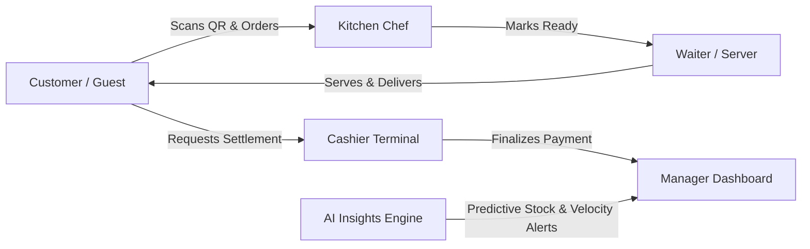

# 🍽️ RestaurantOS: Smart Restaurant Management System
**Project Blueprint & Functional Specification (Immutable Contract)**

---

## 1. Product Vision & Executive Summary

**RestaurantOS** is an innovative, AI-powered Restaurant Operating System engineered specifically to eradicate traditional back-of-house bottlenecks and streamline indoor/hybrid dine-in operations. Designed for high-impact evaluation at the **Smart Restaurant Management System Hackathon**, RestaurantOS rejects the common paradigm of creating yet another consumer food delivery application. Instead, it serves as an agile, synchronized central dashboard that seamlessly links guests, floor staff, kitchen crews, cashiers, and restaurant management into a single, cohesive real-time feedback loop.

Our architectural ethos is centered on **Demo-First Development**: prioritizing velocity, stability, user experience, and practical AI diagnostic utility over enterprise ERP bloat.

---

## 2. Problem Statement

Modern dine-in restaurants face systemic operational breakdowns rooted in fragmented communication and reactive management:
- **Floor Communication Latency**: Waiters waste critical minutes walking back and forth to check order preparation statuses, leading to delayed service and cold food.
- **Disconnected Kitchen Displays**: Traditional printed tickets cause kitchen station confusion, dietary omission errors, and an inability to dynamically communicate out-of-stock items to servers and diners.
- **Blind Executive Operations**: Restaurant managers lack real-time visibility into table turnover velocities, item cooking latencies, and service bottleneck points during rush hours.
- **Surprise Inventory Depletion**: High-velocity ingredients (such as specialty cheeses, prime meat cuts, or craft beverages) run out unexpectedly mid-service without early predictive warning.

---

## 3. Core Goals & Operational Scope

### Scope Rule
This implementation targets **ONE individual restaurant operational workspace**. To ensure zero friction during live demonstration, multi-tenant architectures, restaurant chain hierarchies, and multi-branch complexity have been deliberately excluded from the Phase 1 execution scope (see [`PRODUCT_DECISIONS.md`](file:///c:/Users/admin/Desktop/trash/restaurant-os/docs/PRODUCT_DECISIONS.md) for future multi-tenant architectural specifications).

### Project KPI Objectives
- **Sub-100ms Event Synchronization**: Eliminate page refreshing entirely by routing order placements, kitchen updates, and waiter assistance calls across persistent WebSocket channels.
- **Zero Hallucination Operational AI**: Deploy structured diagnostic intelligence focused solely on ingredient consumption rate predictions and operational trend anomalies.
- **Frictionless Demo Journey**: Deliver a flawless, deterministic 10-step hackathon walkthrough demonstrating immediate cross-device operational synergy.

---

## 4. Primary User Personas & Role Boundaries

1. **Customer / Guest**:
   - Accesses the digital restaurant environment instantly via dining table QR scans.
   - Browses live menus synchronized directly with kitchen stock availability.
   - Books table queues or initiates interactive order placement without installing secondary mobile software.
2. **Kitchen Staff / Chef**:
   - Interacts with a high-visibility Kitchen Display System (KDS).
   - Receives instant ticket routing, monitors preparation cooking timers, and toggles items "Out of Stock" to immediately block menu ordering.
3. **Waiter / Server**:
   - Manages floor coordination via an agile waiter terminal.
   - Receives instant, targeted notifications when kitchen dishes reach "Ready to Serve" status or when seated guests request table assistance.
4. **Cashier**:
   - Operates a streamlined billing checkout interface.
   - Retrieves active table order sessions, compiles billing totals, processes payment settlements, and transitions table cleaning statuses.
5. **General Manager / Executive**:
   - Monitors live restaurant analytics: daily revenue accumulation, average preparation duration, table occupancy turnover rates, and item sales distribution.
   - Receives actionable, real-time AI predictive intelligence warnings to adjust staffing or inventory sourcing.

---

## 5. Architectural Mandates
- **No Fake APIs**: Every feature must execute against live relational database schemas and reactive webhooks.
- **UI Design Authority**: All visual frontend identities, layout structures, spacing tokens, and color branding remain under exclusive user control per the project UI Rule.
- **Code Quality Immutable Contract**: Codebase strictly complies with SOLID principles, DRY methodologies, explicit TypeScript types, and Zod input boundaries.
