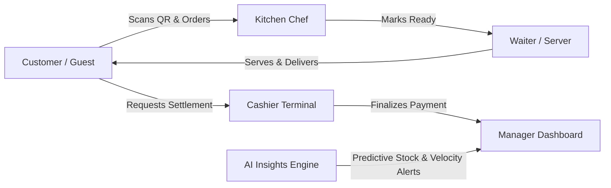

# 🍽️ RestaurantOS: Smart Restaurant Management System
**Project Blueprint & Functional Specification (Immutable Contract)**

---

## 1. Product Vision & Executive Summary

**RestaurantOS** is an innovative, AI-powered Restaurant Operating System engineered specifically to eradicate traditional back-of-house bottlenecks and streamline indoor/hybrid dine-in operations. Designed for high-impact evaluation at the **Smart Restaurant Management System Hackathon**, RestaurantOS rejects the common paradigm of creating yet another consumer food delivery application. Instead, it serves as an agile, synchronized central dashboard that seamlessly links guests, floor staff, kitchen crews, cashiers, and restaurant management into a single, cohesive real-time feedback loop.

Our architectural ethos is centered on **Demo-First Development**: prioritizing velocity, stability, user experience, and practical AI diagnostic utility over enterprise ERP bloat.

---

## 2. Problem Statement

Modern dine-in restaurants face systemic operational breakdowns rooted in fragmented communication and reactive management:
- **Floor Communication Latency**: Waiters waste critical minutes walking back and forth to check order preparation statuses, leading to delayed service and cold food.
- **Disconnected Kitchen Displays**: Traditional printed tickets cause kitchen station confusion, dietary omission errors, and an inability to dynamically communicate out-of-stock items to servers and diners.
- **Blind Executive Operations**: Restaurant managers lack real-time visibility into table turnover velocities, item cooking latencies, and service bottleneck points during rush hours.
- **Surprise Inventory Depletion**: High-velocity ingredients (such as specialty cheeses, prime meat cuts, or craft beverages) run out unexpectedly mid-service without early predictive warning.

---

## 3. Core Goals & Operational Scope

### Scope Rule
This implementation targets **ONE individual restaurant operational workspace**. To ensure zero friction during live demonstration, multi-tenant architectures, restaurant chain hierarchies, and multi-branch complexity have been deliberately excluded from the Phase 1 execution scope (see [`PRODUCT_DECISIONS.md`](file:///c:/Users/admin/Desktop/trash/restaurant-os/docs/PRODUCT_DECISIONS.md) for future multi-tenant architectural specifications).

### Project KPI Objectives
- **Sub-100ms Event Synchronization**: Eliminate page refreshing entirely by routing order placements, kitchen updates, and waiter assistance calls across persistent WebSocket channels.
- **Zero Hallucination Operational AI**: Deploy structured diagnostic intelligence focused solely on ingredient consumption rate predictions and operational trend anomalies, guaranteed by deterministic local fallbacks.
- **Frictionless Demo & Reset Execution**: Deliver a flawless, deterministic 10-step hackathon walkthrough supported by realistic demo seed data and a one-command reset environment (`npm run demo:reset`).

---

## 4. Primary User Personas & Role Boundaries



1. **Customer / Guest**: Accesses the digital restaurant environment via dining table QR scans, browses live menus synchronized directly with kitchen stock availability, books table queues, or initiates interactive order placement without installing secondary software.
2. **Kitchen Staff / Chef**: Interacts with a high-visibility Kitchen Display System (KDS). Receives instant ticket routing, monitors preparation cooking timers, and toggles items "Out of Stock" to immediately block menu ordering.
3. **Waiter / Server**: Manages floor coordination via an agile waiter terminal. Receives instant, targeted notifications when kitchen dishes reach "Ready to Serve" status or when seated guests request table assistance.
4. **Cashier**: Operates a streamlined billing checkout interface. Retrieves active table order sessions, compiles billing totals in integer cents, processes payment settlements, and transitions table cleaning statuses.
5. **General Manager / Executive**: Monitors live restaurant analytics: daily revenue accumulation, average preparation duration, table occupancy turnover rates, and item sales distribution. Receives actionable AI predictive operational warnings.

---

## 5. Sprint-Based Delivery Roadmap

To guarantee project stability during hackathon development, implementation is strictly broken down into **8 modular Sprints**. **Crucial Mandate**: Each individual sprint must leave the application in a fully compilable, functional, and working state before advancing to the next milestone.

```mermaid
gantt
    title RestaurantOS Sprint-Based Milestone Roadmap
    dateFormat  X
    axisFormat  Sprint %s
    section Core Infrastructure
    Sprint 1: Setup, Database, Auth & Roles      :0, 1
    section Front-of-House
    Sprint 2: Menu, Tables & Reservations          :1, 2
    Sprint 3: Realtime Ordering Engine            :2, 3
    section Back-of-House
    Sprint 4: Kitchen Display System (KDS)        :3, 4
    Sprint 5: Waiter Coordination Console         :4, 5
    section Checkout & Intelligence
    Sprint 6: Cashier POS & Billing Settlement   :5, 6
    Sprint 7: Manager Executive Analytics         :6, 7
    Sprint 8: Operational AI Insights & Fallbacks :7, 8
```

- **Sprint 1 — Project Setup, Database, Authentication, Roles**: Configure relational Supabase schema, establish Role-Based Access Control (RBAC) linking to user profiles, set up `seed.ts`, and test `npm run demo:reset`.
- **Sprint 2 — Menu, Tables, Reservations**: Implement live menu database queries, floor table layout modeling, ephemeral session generation, and guest booking queues.
- **Sprint 3 — Ordering**: Build interactive customer ordering server actions with Zod boundary validation and collaborative table cart sync.
- **Sprint 4 — Kitchen**: Create the Kitchen Display System (KDS) engine with real-time ticket arrival (<100ms), active cooking preparation timers, and item out-of-stock toggles.
- **Sprint 5 — Waiter**: Deploy the Waiter Coordination Console featuring instantaneous WebSocket alert feeds and table assistance management.
- **Sprint 6 — Billing**: Construct the Cashier checkout terminal with cent-based financial calculations, tax aggregation, and table settlement clearing.
- **Sprint 7 — Analytics**: Engine executive managerial dashboard views displaying live table turnover rates, revenue accumulation velocity, and prep latency KPIs.
- **Sprint 8 — AI**: Integrate operational AI predictive inventory forecasts and demand anomaly detection, fortified by zero-downtime deterministic local fallback algorithms.
