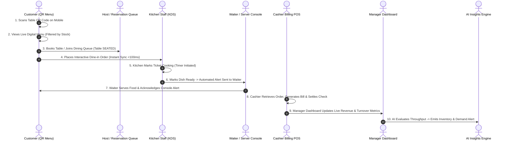
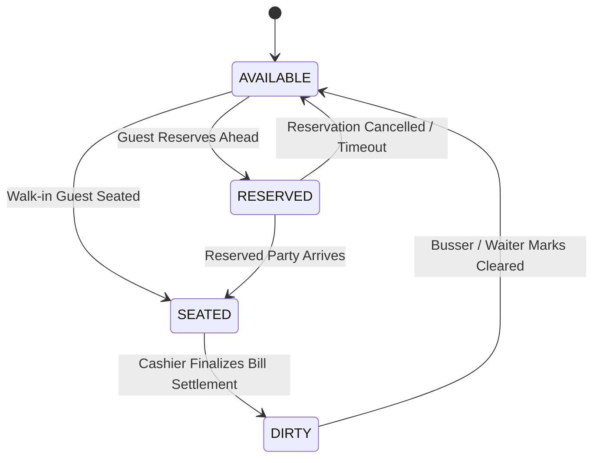
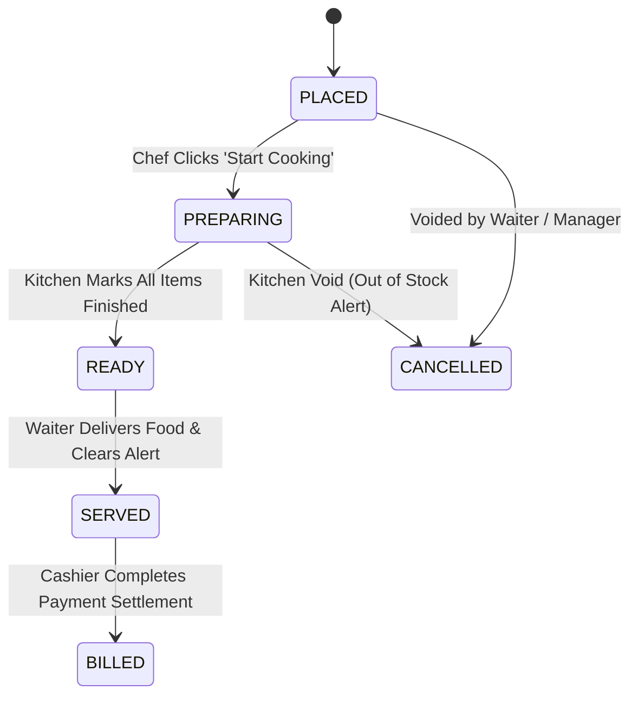

# 🔄 RestaurantOS: Operational Workflows & Lifecycle Modeling
**End-to-End Demo Synchronization Contract (Immutable Contract)**

---

## 1. The 10-Step Demo Operational Journey

To demonstrate maximum product innovation during live evaluation, every implementation feature revolves around a single, unbroken, deterministic 10-step operational workflow:

---

## 2. Finite State Machine (FSM) Specifications

To maintain database integrity and prevent erratic UI transitions, all core entities are bound by deterministic Finite State Machines:

### A. Table Status Lifecycle

1. `AVAILABLE`: Table is fully vacant and ready for new guest allocation.
2. `RESERVED`: Table assigned to an upcoming guest party booking in `reservations`.
3. `SEATED`: Active dining session underway; table QR code validated for dine-in ordering.
4. `DIRTY`: Meal settled; awaiting physical cleanup before re-opening for reservation allocation.

---

### B. Order & Cooking Ticket Lifecycle

1. `PLACED`: Order committed to PostgreSQL via Server Action; appears instantaneously on Kitchen KDS terminal.
2. `PREPARING`: Cooking prep timers activate; items assigned to kitchen preparation crew.
3. `READY`: Food ready for presentation; automatic high-priority real-time alert fires to the assigned Server Console.
4. `SERVED`: Waiter delivers meal to table; order marked complete from operational perspective.
5. `BILLED`: Cashier settles financial check in `payments`; transaction archived to daily revenue analytics.
6. `CANCELLED`: Order nullified due to guest preference or kitchen stock depletion.

---

## 3. Realtime Cross-Role Coordination Guarantees
- **Zero Polling Principle**: Frontend clients must never invoke repetitive polling intervals (e.g., `setInterval`) to check order statuses. All state transitions must propagate via Supabase WebSockets (`orders:live` and `notifications:alerts`).
- **Idempotent Transitions**: Action mutations attempting an invalid state hop (e.g., jumping from `PLACED` directly to `BILLED` without kitchen or server processing) must be intercepted and rejected by Zod service boundary validation.
