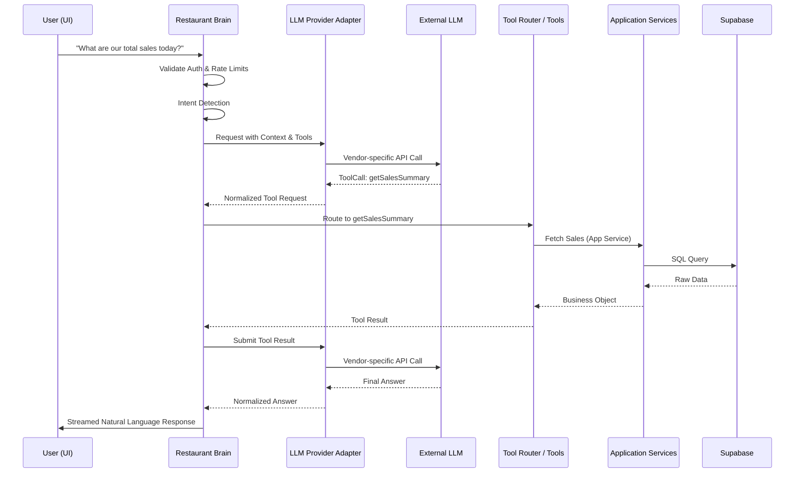

# 02. Architecture

## Purpose
To visualize and define the end-to-end data flow and system architecture for the RestaurantOS AI platform.

## Architectural Philosophy
1. **Structured Tooling:** The LLM is isolated from the database. It interacts solely through strongly typed, authorized tools.
2. **Separation of Concerns:** Tools do not write SQL. Tools interact with the existing `Application Services` layer, which handles business logic and DB access.
3. **Provider & Framework Agnosticism:** The architecture does not depend on a specific LLM vendor or heavy orchestration frameworks.

## System Diagram

## Component Details

### 1. The Client (UI)
Minimal logic. Sends natural language text and metadata, receives Markdown/Text streams.

### 2. The Restaurant Brain (API Layer)
The stateless orchestrator handling context, logging, intent detection, and tool routing.

### 3. LLM Provider Adapter
An abstraction layer that normalizes prompts and tool schemas into the specific format required by the underlying LLM provider (e.g., standardizing OpenAI's function calling vs. Anthropic's tool use vs. Gemini).

### 4. Restaurant Tools
The internal APIs exposed to the LLM. They parse LLM arguments, validate them, and delegate execution to Application Services.

### 5. Application Services
The core business logic layer. Encapsulates database queries (Supabase), caching, and external integrations (Stripe, Twilio). This ensures the AI uses the exact same data pathways as the standard dashboard.
