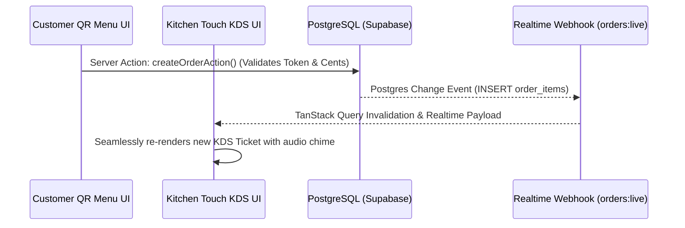

# 🗺️ RestaurantOS Information Architecture & UX Structure
**Navigation Tree & State Governance Specification (Immutable Design Contract)**
*Reference: [PROJECT.md](file:///c:/Users/admin/Desktop/trash/restaurant-os/docs/PROJECT.md), [ARCHITECTURE.md](file:///c:/Users/admin/Desktop/trash/restaurant-os/docs/ARCHITECTURE.md)*

---

## 1. Executive Structural Philosophy (Single-Location Lean Architecture)

As governed by [PRODUCT_DECISIONS.md](file:///c:/Users/admin/Desktop/trash/restaurant-os/docs/PRODUCT_DECISIONS.md), RestaurantOS is engineered exclusively for **one commercial restaurant location**. The Information Architecture (IA) eliminates enterprise multi-tenant overhead, branch dropdowns, and complex org-switcher hierarchies. 

The application surface is structured around **five operational user roles**: **Customer (Guest)**, **Waiter (Server)**, **Kitchen (Chef)**, **Cashier (POS Ledger)**, and **Manager (Executive & AI Admin)**. Navigation boundaries are streamlined so each persona is immersed directly in their specialized workspace with minimum tap friction.

---

## 2. Global App Router Navigation Map

The visual application landscape is organized into distinct, responsive route territories within Next.js 15 App Router (`app/`):

```mermaid
graph TD
    Root["/ (Public Restaurant Hub)"]
    
    subgraph Public & Guest Surfaces
        Root --> ResHub["/reservations (Table Availability & Booking)"]
        Root --> QrMenu["/menu/[table_id]/[token] (Live Digital Menu & Order Loop)"]
    end
    
    subgraph Operational Staff Consoles (Authenticated RBAC)
        Root --> Auth["/login (Staff Operational Identification)"]
        Auth --> Waiter["/waiter (Dining Floor Map & Alert Center)"]
        Auth --> Kitchen["/kitchen (Widescreen Touch KDS & Stock Control)"]
        Auth --> Cashier["/cashier (POS Terminal & Bill Settlement Hub)"]
        Auth --> Manager["/manager (Executive Analytics & AI Diagnostics)"]
    end

    classDef public fill:#1e293b,stroke:#0d9488,color:#f8fafc;
    classDef staff fill:#0f172a,stroke:#f97316,color:#f8fafc;
    class Root,ResHub,QrMenu public;
    class Auth,Waiter,Kitchen,Cashier,Manager staff;
```

---

## 3. Role-Based Navigation & Access Boundaries

To ensure clean separation of concerns and operational focus, user interfaces adapt dynamically based on the current active authenticated persona:

### A. Customer / Guest Navigation Experience (Zero Friction)
* **Entry Mode**: Scanning a physical QR code situated on their dining table (e.g. `https://app.demo/menu/uuid-table-4/table_4_sess_9a82`).
* **Navigation Architecture**: Single-page app experience utilizing bottom tab bars and floating sheet drawers. Guests browse category tabs, open item detail customizer modals, view their running table bill check, and push a tactile "Call Waiter" alert button.
* **Security & Isolation**: Customers have zero visibility into staff consoles, financial ledgers, or back-of-house kitchen queues.

### B. Waiter / Server Handheld Console (`/waiter`)
* **Entry Mode**: Authenticated access via smartphone or iPad mini tablet.
* **Navigation Architecture**: Two primary tabs: **Floor Map View** (visual grid of Tables 1 through 12 color-coded by occupancy status) and **Live Alert Feed** (chronological list of active table assistance calls and ready food notifications).
* **Key Actions**: Clicking a table opens an instant slide-in table session drawer to generate new guest QR session tokens or manually transition tables (`SEATED -> DIRTY -> AVAILABLE`).

### C. Kitchen Display System - KDS Touchscreen Monitor (`/kitchen`)
* **Entry Mode**: Wall-mounted widescreen landscape monitors operated by Kitchen Head Chefs and prep cooks.
* **Navigation Architecture**: Full-screen, clutter-free horizontal card kanban grid. Top header bar displays kitchen velocity metrics and an **86 Stock Toggle** button to instantaneously open the ingredient availability management switchboard.
* **Key Actions**: Single-tap large buttons on individual order tickets to advance cooking stages (`QUEUED -> COOKING -> READY`).

### D. Cashier & POS Checkout Terminal (`/cashier`)
* **Entry Mode**: Countertop landscape touch screen or cashier workstation terminal.
* **Navigation Architecture**: Split-screen workflow. Left pane lists unpaid dining table checks and pending online reservation deposits. Right pane renders an interactive item splitting calculator, payment method selector (`CASH`, `CARD`, `DIGITAL_WALLET`), and receipt print generator.

### E. Executive Manager & Operational AI Hub (`/manager`)
* **Entry Mode**: Laptop or administrative desktop browser.
* **Navigation Architecture**: High-density analytics dashboard featuring tabular daily revenue trends, item velocity leaderboards, and an integrated **AI Operational Advisory Feed** reporting predictive inventory runout timelines (e.g., Cheddar Cheese stock alerts).
* **Override Authority**: Managers possess overriding navigation access to inspect and modify any table status, dining reservation, or menu dish price across the ecosystem.

---

## 4. State Persistence & Data Ownership Architecture

RestaurantOS combines Next.js 15 App Router Server Components, Server Actions, TanStack Query, and Supabase Realtime Channels to synchronize state without page refresh delays:



* **Server-Owned State (Single Source of Truth)**: Menu catalogs, table occupancy status, active QR session tokens, order progression items, and inventory counts are mastered in PostgreSQL and mutated exclusively via validated Next.js Server Actions (`actions/*.ts`).
* **Client-Owned Transient State**: Active menu category filter selections, open item customization dialogs, local shopping bag contents before submission, and table map sorting preferences reside cleanly in local React state or URL search parameter query strings.
* **Realtime Synchronization (WebSocket Channels)**: Active staff screens subscript to our designated channels (`orders:live`, `notifications:alerts`, `tables:status`). When database mutations occur, UI screens seamlessly prepend new KDS tiles or flash alert badges without forcing full page DOM reloads.

---

## 5. Offline & Deterministic Fallback UX Boundaries

As governed by [DEVELOPMENT.md](file:///c:/Users/admin/Desktop/trash/restaurant-os/docs/DEVELOPMENT.md), RestaurantOS must remain completely stable during high-stakes hackathon demonstrations and live operational judging even if external networks or third-party APIs stumble:

1. **AI Advisor Local Deterministic Fallback**:
   * If the external Google Gemini AI endpoint experiences network latency or quota limits during an inventory analysis, the backend transparently triggers our local deterministic calculations.
   * **UX Contract**: The visual Executive AI Advisor card maintains an identical high-aesthetic presentation regardless of whether insights were synthesized by Gemini or computed locally—zero error toasts or broken UI layout shifts occur.
2. **Offline Demo Verification Reset (`demo:reset`)**:
   * The UI architecture fully supports automated local database verification and seeding simulation mode when live Supabase cloud connectivity is offline, ensuring reliable hackathon evaluation at all times.
