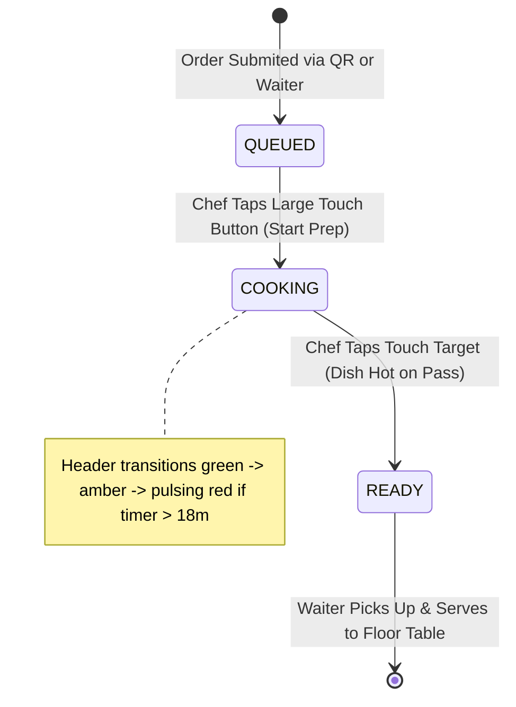
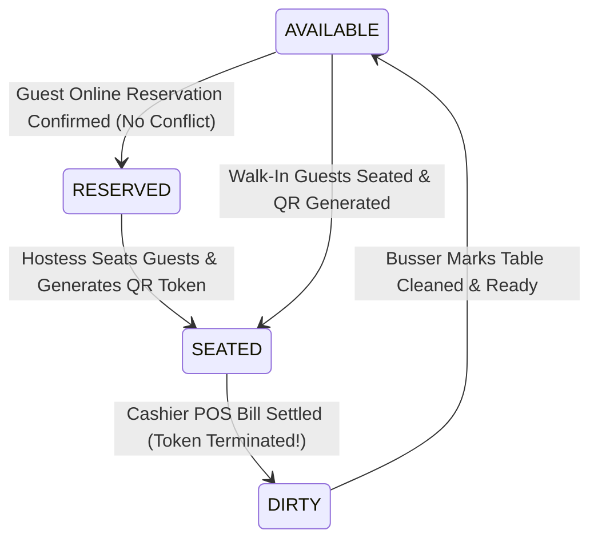

# 🌊 RestaurantOS Complete User Flows
**End-to-End Operational Journey Specifications (Immutable Design Contract)**
*Reference: [WORKFLOWS.md](file:///c:/Users/admin/Desktop/trash/restaurant-os/docs/WORKFLOWS.md), [DATABASE.md](file:///c:/Users/admin/Desktop/trash/restaurant-os/docs/DATABASE.md)*

---

## 1. Architectural Workflow Alignment

This document articulates the step-by-step user experience journeys across RestaurantOS. Each flow bridges frontend interface interactions with validated Next.js Server Actions, PostgreSQL database state mutations, and WebSocket realtime channel synchronizations to solve concrete operational problems inside a single restaurant location.

---

## 2. Primary Operational User Flows

### Flow 1: Guest Dining & Live Ordering Loop (QR Table Session)
* **Problem Solved**: Eliminates dining room waiting friction by empowering seated guests to directly place culinary orders through verified table session tokens without waiting for staff order-taking pads.
* **Persona**: Dining Guest / Customer at Table 4.

```mermaid
sequenceDiagram
    autonumber
    actor Guest as Customer (Smartphone)
    participant UI as QR Menu (SCR-02/03)
    participant Action as Next.js Server Action
    participant DB as PostgreSQL Database
    participant KDS as Chef Kitchen Monitor (SCR-08)

    Guest->>UI: Scan Table 4 QR Code & Navigate to URL
    UI->>Action: validateTableQrSessionAction(table_id, token)
    Action->>DB: Query tables.current_qr_token & status == SEATED
    DB-->>UI: Session Verified: Render Active Catalog with prices ($ price_cents/100)
    Guest->>UI: Add Truffle Fries & Cheeseburger to Bag; Tap "Submit Order"
    UI->>Action: createOrderAction(table_id, items[])
    Action->>DB: INSERT orders & order_items; update stock velocity
    DB--)KDS: Realtime Webhook Broadcast (orders:live channel)
    UI-->>Guest: Render Visual FSM Tracker: State = PLACED with estimated timer
    KDS->>KDS: Play alert chime & render high-contrast Cooking Ticket
```

#### Detailed Step Action Matrix:
1. **QR Scanning & Authentication**: Guest scans physical tabletop placard. System verifies cryptographic session token via `validateTableQrSessionAction`. If token fails (e.g., table previously cleaned/voided), display explicit unauthorized recovery card.
2. **Catalog Exploration**: Guest filters menu categories and selects artisan dishes. All financial presentations transform integer `price_cents` into formatted standard currency (e.g., 1450 -> `$14.50`).
3. **Cart Submission & Validation**: Guest hits submit. Server Action validates menu item availability (`is_available == true`) and logs order header and line items.
4. **Real-time Live Tracking**: Guest screen switches to `SCR-03` Tracker, displaying dynamic order state pills (`PLACED -> PREPARING -> READY -> SERVED`).

---

### Flow 2: Kitchen Display System (KDS) Order Fulfillment Loop
* **Problem Solved**: Removes noisy paper kitchen tickets and verbal miscommunications by providing wall-mounted widescreen touch displays with ticking prep timers and single-touch stage advancements.
* **Persona**: Kitchen Head Chef / Line Cook.



#### Detailed Step Action Matrix:
1. **Ticket Ingest**: When `orders:live` WebSocket channel emits an insert event, `SCR-08` KDS Touch Monitor automatically appends a new culinary ticket card with an initial **Emerald Green Header** (`QUEUED`).
2. **Prep Initiation**: Line Chef taps the massive bottom touch target on the ticket. Server action `updateOrderItemStatusAction` updates Postgres status to `COOKING`. Card header shifts to **Amber Orange** and starts active prep elapsed timing clock.
3. **Pass Completion**: Dish is completed and staged on the hot kitchen pass. Chef taps ticket to mark `READY`. System sets order state to `READY`, card border illuminates with **Crimson Neon Pulse**, and an automated Realtime Alert notification (`ORDER_READY`) fires directly to the designated Waiter handheld console (`SCR-07`).

---

### Flow 3: Table Lifecycle & Reservation Double-Booking Prevention
* **Problem Solved**: Prevents catastrophic host dining room double bookings during peak dinner service while ensuring clean table bussing turnaround after cashier checkouts.
* **Personas**: Hostess, Waiter, Cashier, Busser.



#### Detailed Step Action Matrix:
1. **Availability Query**: On `SCR-01`, guest submits date and party size. `checkTableAvailabilityAction` executes interval conflict detection against existing active reservations within a +/- 90 minute dining window. Conflicting tables are strictly excluded.
2. **Seating & QR Token Generation**: Host welcomes arrived party to Table 4. On tablet `SCR-05`, Host taps "Seat & Generate QR". `generateTableSessionAction` updates status from `AVAILABLE` to `SEATED` and assigns a fresh cryptographic token string (`table_4_sess_9a82`).
3. **Bill Settlement & Token Destruction**: Upon finishing dinner, Cashier settles check on `SCR-10`. Server Action advances table state from `SEATED` directly to `DIRTY` and instantaneously sets `current_qr_token` to `null`. This prevents departed guests from accessing digital orders.
4. **Table Turnaround**: Busser cleans table and taps "Mark Cleaned" on handheld. Status resets to `AVAILABLE`, ready for next service flow.

---

### Flow 4: Executive AI Advisory & Predictive Runout Mitigation
* **Problem Solved**: Bridges intelligent analytical monitoring with instant operational action during high-stress culinary rushes when ingredient inventories hit critical depletion zones.
* **Personas**: Executive Manager / Head Chef.

```mermaid
sequenceDiagram
    autonumber
    participant KDS as Kitchen Order Loop
    participant DB as Postgres (inventory)
    participant AI as AI Advisor Engine (Gemini / Local Fallback)
    participant Mgr as Manager Console (SCR-12)
    participant Menu as Live Customer QR Menu

    KDS->>DB: Consume 14 units of 🧀 Cheddar Cheese (Threshold Hit)
    DB->>AI: Trigger threshold_warning_units check
    AI->>AI: Synthesize diagnostic velocity (LLM / Local Deterministic Math)
    AI-->>Mgr: Render Critical glowing advisory: "Cheddar Cheese runout in 42 mins!"
    Mgr->>Mgr: Review recommendation; Click "Auto-86 Cheeseburger Stock" button
    Mgr->>DB: toggleMenuItemAvailabilityAction(cheeseburger_id, false)
    DB--)Menu: Realtime Catalog Update
    Menu->>Menu: Cheeseburger card dims to "SOLD OUT" instantly across all guest devices
```

#### Detailed Step Action Matrix:
1. **Threshold Trigger**: Ongoing kitchen order preparations decrement `inventory.current_stock_units` for **🧀 Cheddar Cheese** down to 14 units (below warning threshold of 15).
2. **AI Synthesis (With Fallback Resilience)**: System invokes `generateAiOperationalInsightsAction()`. If cloud AI connectivity is nominal, Gemini generates structured diagnostic guidance. If network is offline, onboard deterministic calculation engine computes accurate depletion countdown (e.g., *"Current burn rate depletes stock in 42 minutes"*).
3. **One-Click Mitigation**: On `SCR-12`, Executive Manager inspects glowing red advisory card and taps recommended action button: **"Auto-86 Cheeseburger Stock"**.
4. **Realtime Catalog Sync**: The Server Action immediately toggles `is_available = false` on the Cheeseburger dish. In zero milliseconds, all seated customer smartphones (`SCR-02`) automatically re-render the Cheeseburger card as a dimmed, non-interactive **"SOLD OUT"** tile—preventing ordered stock failures!
